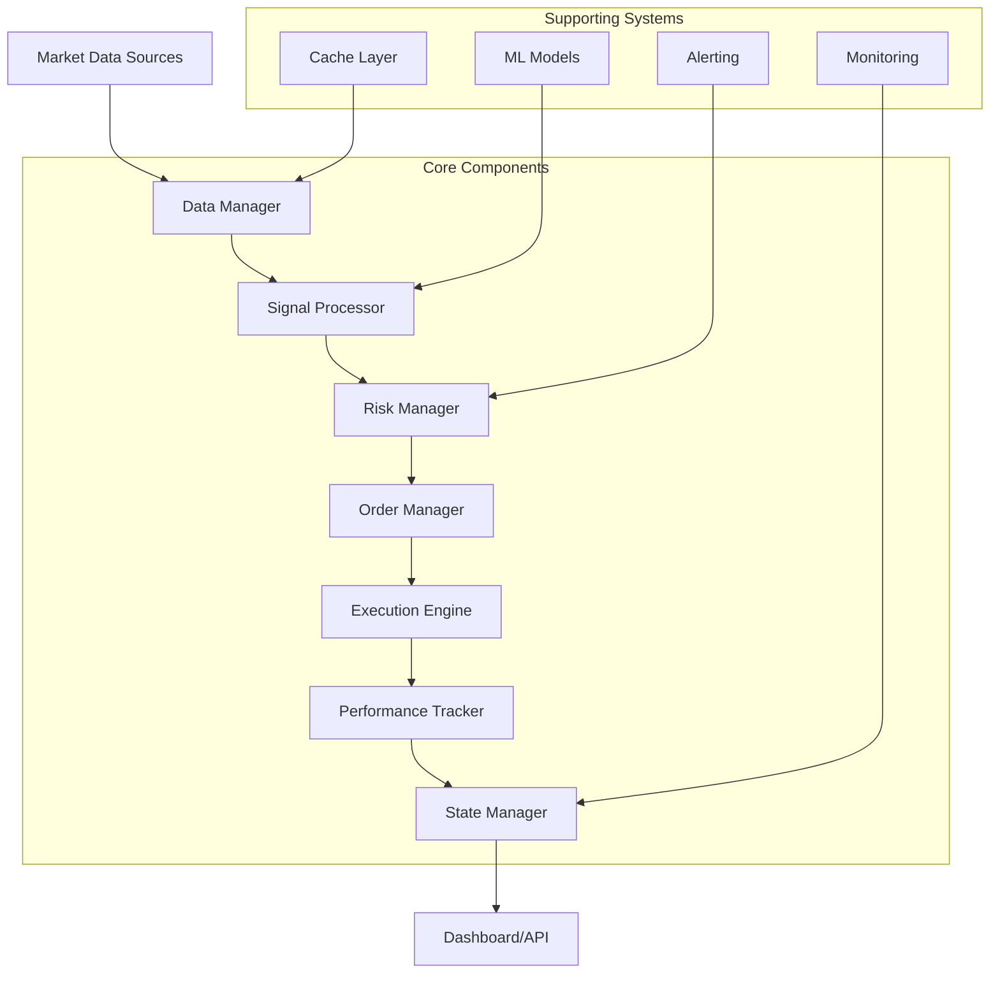
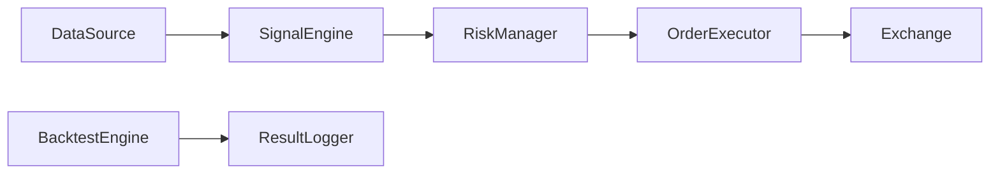
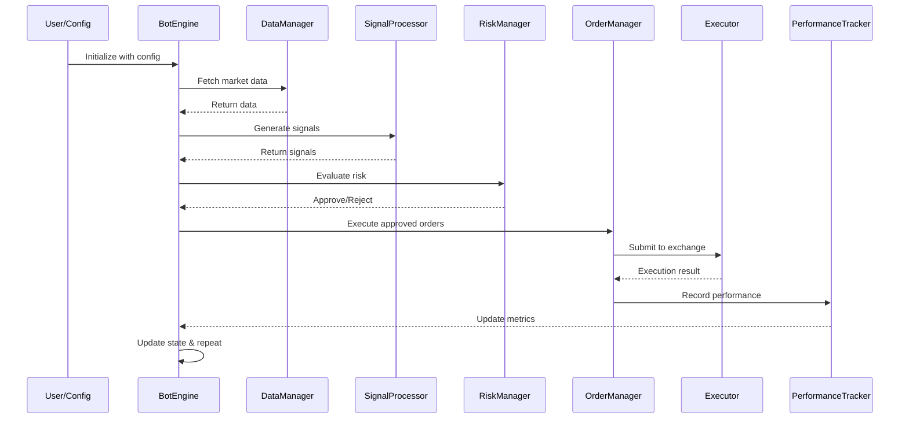

# N1V1 Crypto Trading Framework


```mermaid
flowchart TD
    subgraph Ingress [Data Ingestion Layer]
        A[External Exchange APIs (Binance / CCXT / CSV)]
        B[Historical Data / Live Streams]
    end

    subgraph Processing [Core Engine Pipeline]
        C[Strategy Plugins / ML Signal Engines]
        D[Risk Management Layer]
        E[Order Router & Execution Logic]
    end

    subgraph Output [Execution Targets & Observability]
        F[Paper Trading / Backtest Engine]
        G[Live Exchange Execution]
        H[Logs / Metrics / Reporting]
    end

    A --> C
    B --> C
    C --> D
    D --> E
    E --> F
    E --> G
    F --> H
    G --> H
```

**Enterprise-grade automated cryptocurrency trading framework with institutional-level risk management, AI-powered optimization, and production-ready reliability.**

## Why This Exists

N1V1 addresses the critical need for sophisticated, scalable trading systems in the cryptocurrency markets. Traditional trading approaches lack the robustness required for 24/7 automated operation. This framework provides:

- **Institutional-grade risk controls** with circuit breaker systems and adaptive policies
- **AI-enhanced signal processing** using machine learning for market regime detection
- **Production reliability** with comprehensive monitoring, error recovery, and self-healing capabilities
- **Scalable architecture** supporting multiple strategies, exchanges, and concurrent operations
- **Enterprise monitoring** with Prometheus/Grafana integration and real-time dashboards

## Who Is This For?

| Persona                   | Profile                                                | How They Benefit                             |
| ------------------------- | ------------------------------------------------------ | -------------------------------------------- |
| Solo Quant Trader         | Builds and tests strategies alone                      | Fast iteration, automation, reproducibility  |
| Prop Firm / Desk Engineer | Scales execution for multiple strategies               | Modular, auditable, risk-managed             |
| ML / Research Engineer    | Trains and deploys predictive models into trading loop | Built-in signal hooks and inference pipeline |
| Plugin Developer          | Extends framework with new indicators or executors     | Well-defined extension contracts             |

## TL;DR — Key Features at a Glance

✅ Modular, Plug-and-Play Architecture
✅ Fully Async or Sync Execution Engine
✅ Strategy Plugins & ML Signal Hooks
✅ Backtest and Live Execution from Same Interface
✅ First-Class Risk Management & Circuit Breakers
✅ Extensible Configuration (YAML / ENV / CLI)
✅ Rich Logging, Observability & Debug Tracing

## Architecture Overview



## Proven Results (Example Backtest / Live Run)

*Note: Results shown are from framework testing. Replace with your actual performance data.*

| Metric        | Value    |
| ------------- | -------- |
| Total Return  | +263.07% |
| Win Rate      | 69.44%   |
| Max Drawdown  | 18.47%   |
| Sharpe Ratio  | 8.68     |
| Profit Factor | 3.32     |

## System Dependencies



## Execution Lifecycle



## Module Breakdown

### Core Framework (`core/`)
**Purpose**: Core framework backbone with async processing, event-driven architecture, risk management, monitoring, and trading coordination.

**Public Entry Points**: `get_component_factory()`, `get_config_manager()`, `get_memory_manager()`

**Key Classes / Functions**:
- `BotEngine`: Main trading engine with async processing and event-driven architecture
- `CircuitBreaker`: Advanced circuit breaker system for automatic trading suspension
- `PerformanceMonitor`: System performance monitoring with metrics collection
- `TradingCoordinator`: Coordinates multiple trading strategies and execution
- `SignalProcessor`: Processes and routes trading signals across strategies
- `OrderManager`: Manages order lifecycle from creation to execution
- `StateManager`: Maintains system state and configuration persistence
- `TaskManager`: Asynchronous task scheduling and execution
- `MemoryManager`: Memory optimization and leak prevention
- `Cache`: High-performance caching system for market data
- `ConfigManager`: Configuration management with validation
- `DashboardManager`: Web dashboard management and real-time updates
- `Diagnostics`: System diagnostics and health monitoring
- `SelfHealingEngine`: Automatic error recovery and system stabilization
- `TimeframeManager`: Multi-timeframe data management and synchronization
- `Watchdog`: System watchdog for process monitoring and restart

**Processing Flow**: Market data fetch → Signal generation → Risk evaluation → Order execution → State update

**Dependencies**: pandas, numpy, asyncio, prometheus_client

**Extension / Plug Points**: Interfaces for data_manager, signal_processor, risk_manager, order_executor

### Data Management (`data/`)
**Purpose**: Data acquisition, processing, and management for historical and real-time market data.

**Public Entry Points**: `DataFetcher`, `HistoricalDataLoader`, `DatasetVersionManager`

**Key Classes / Functions**:
- `DataFetcher`: Fetches data from exchanges with rate limiting
- `HistoricalDataLoader`: Loads historical data with pagination
- `DatasetVersionManager`: Versions datasets with integrity checking

**Processing Flow**: Fetch data from exchange → Validate and parse → Cache data → Return DataFrame

**Dependencies**: ccxt, pandas, aiofiles

**Extension / Plug Points**: `IDataFetcher` interface for custom data sources

### API & Web Interface (`api/`)
**Purpose**: REST API for web interface, monitoring, and external integration.

**Public Entry Points**: `app.py` (FastAPI app), `health_check`, `metrics`, `dashboard`

**Key Classes / Functions**:
- FastAPI app with endpoints for status, orders, signals, equity, performance

**Processing Flow**: HTTP request → Authentication → Rate limiting → Handler → Response

**Dependencies**: fastapi, uvicorn, sqlalchemy

**Extension / Plug Points**: Middleware for custom authentication, rate limiting

### Backtesting (`backtest/`)
**Purpose**: Backtesting framework for strategy evaluation with historical data.

**Public Entry Points**: `Backtester` class, `compute_backtest_metrics`, export functions

**Key Classes / Functions**:
- `Backtester`: Runs backtests on strategies
- `compute_backtest_metrics`: Calculates Sharpe, drawdown, etc.
- Export functions for equity progression and results

**Processing Flow**: Strategy genome + market data → Simulate trades → Calculate metrics → Export results

**Dependencies**: pandas, numpy

**Extension / Plug Points**: Strategy genome interface for custom strategies

### Trading Strategies (`strategies/`)
**Purpose**: Trading strategy implementations using technical indicators.

**Public Entry Points**: `BaseStrategy` class, specific strategy classes like `EMACrossStrategy`, `RSIStrategy`, etc.

**Key Classes / Functions**:
- `BaseStrategy`: Abstract base class defining strategy interface
- `EMACrossStrategy`: Exponential moving average crossover strategy
- `RSIStrategy`: Relative strength index mean-reversion strategy
- `MACDStrategy`: Moving average convergence divergence momentum strategy
- `BollingerReversionStrategy`: Bollinger bands mean-reversion strategy
- `StochasticStrategy`: Stochastic oscillator momentum strategy
- `KeltnerChannelStrategy`: Keltner channel volatility breakout strategy
- `DonchianBreakoutStrategy`: Donchian channel breakout strategy
- `ATRBreakoutStrategy`: Average true range volatility breakout strategy
- `VWAPPullbackStrategy`: Volume weighted average price pullback strategy
- `OBVStrategy`: On-balance volume momentum strategy
- `IndicatorsCache`: Technical indicator caching and optimization

**Processing Flow**: Market data → Calculate indicators → Generate signals → Return TradingSignal list

**Dependencies**: pandas, numpy, ta (technical analysis)

**Extension / Plug Points**: `BaseStrategy` inheritance for custom strategies

### Utilities (`utils/`)
**Purpose**: Utility functions for configuration, logging, error handling, security, and code quality.

**Public Entry Points**: Various utility functions like `get_config_factory()`, `get_error_handler()`, `setup_logging()`, etc.

**Key Classes / Functions**:
- `ConfigFactory`: Configuration file generation and management
- `ErrorHandler`: Centralized error handling and logging
- `LoggingManager`: Advanced logging with rotation and filtering
- `Security`: Security utilities and encryption
- `CodeQualityAnalyzer`: Code complexity and quality analysis
- `DocstringStandardizer`: Documentation standardization
- `DuplicationAnalyzer`: Code duplication analysis and reporting
- `DependencyManager`: Dependency injection and management

**Processing Flow**: Varies by utility, e.g., config loading → validation → caching

**Dependencies**: ast, logging, pydantic

**Extension / Plug Points**: Plugin interfaces for custom loggers, error handlers, etc.

### Machine Learning (`ml/`)
**Purpose**: Machine learning components for feature engineering, model training, and signal filtering.

**Public Entry Points**: `FeatureExtractor`, `MLFilter`, `train_model_binary`, etc.

**Key Classes / Functions**:
- `FeatureExtractor`: Feature engineering from market data
- `MLFilter`: Signal validation using ML models
- `ModelMonitor`: Performance tracking for ML models
- Training pipeline functions for model development

**Processing Flow**: Data → Feature extraction → Model training/prediction → Signal filtering

**Dependencies**: sklearn, xgboost, pandas, numpy

**Extension / Plug Points**: `MLModel` abstract class for custom models

### Risk Management (`risk/`)
**Purpose**: Risk management with position sizing, anomaly detection, and adaptive policies.

**Public Entry Points**: `RiskManager`, `AnomalyDetector`, `AdaptiveRiskPolicy`

**Key Classes / Functions**:
- `RiskManager`: Position sizing and limits enforcement
- `AnomalyDetector`: Market anomaly detection using statistics
- `AdaptiveRiskPolicy`: Dynamic risk adjustment based on conditions

**Processing Flow**: Signal → Risk evaluation → Position sizing → Anomaly check → Approval/Rejection

**Dependencies**: pandas, numpy, scipy

**Extension / Plug Points**: `BaseAnomalyDetector` for custom detectors

### Portfolio Management (`portfolio/`)
**Purpose**: Portfolio management with allocation, rebalancing, and hedging.

**Public Entry Points**: `PortfolioManager`, `AllocationEngine`, `StrategyEnsembleManager`

**Key Classes / Functions**:
- `PortfolioManager`: Position tracking and rebalancing
- `AllocationEngine`: Asset allocation algorithms
- `PortfolioHedger`: Risk hedging strategies
- `PerformanceAggregator`: Portfolio performance aggregation

**Processing Flow**: Positions → Performance calculation → Rebalancing triggers → Allocation adjustment → Trade execution

**Dependencies**: pandas, numpy, scipy

**Extension / Plug Points**: `CapitalAllocator` abstract class for custom allocators

### Optimization (`optimization/`)
**Purpose**: Strategy optimization using genetic algorithms, Bayesian optimization, walk-forward analysis, and cross-asset validation.

**Public Entry Points**: `OptimizerFactory`, `create_walk_forward_optimizer`, etc.

**Key Classes / Functions**:
- `BaseOptimizer`: Abstract base class for optimization algorithms
- `GeneticOptimizer`: Genetic algorithm-based parameter optimization
- `BayesianOptimizer`: Bayesian optimization for hyperparameter tuning
- `WalkForwardOptimizer`: Walk-forward analysis for strategy validation
- `CrossAssetValidator`: Cross-asset validation and overfitting prevention

**Processing Flow**: Strategy genome → Parameter optimization → Backtest evaluation → Fitness scoring → Next generation

**Dependencies**: deap, scikit-optimize, pandas, numpy

**Extension / Plug Points**: `BaseOptimizer` for custom optimizers

## Configuration & Extensibility

### Core Configuration
```json
{
  "exchange": {
    "name": "binance",
    "api_key": "your_api_key",
    "api_secret": "your_api_secret",
    "testnet": true
  },
  "risk_management": {
    "max_position_size": 0.02,
    "max_drawdown": 0.1,
    "circuit_breaker_enabled": true,
    "circuit_breaker_threshold": 0.05
  },
  "monitoring": {
    "prometheus_enabled": true,
    "grafana_enabled": true,
    "alerting_enabled": true
  },
  "strategies": {
    "active_strategies": ["ema_cross", "rsi", "macd"],
    "max_concurrent": 5
  }
}
```

### Extension Points
- **Strategies**: Inherit from `BaseStrategy` for custom trading logic
- **Risk Managers**: Implement `RiskManagerInterface` for custom risk controls
- **Data Sources**: Implement `IDataFetcher` for custom market data providers
- **Optimizers**: Extend `BaseOptimizer` for custom optimization algorithms
- **ML Models**: Extend `MLModel` for custom machine learning algorithms
- **Allocators**: Implement `CapitalAllocator` for custom portfolio allocation

## Security & Safety Model

This framework is designed with safety-first execution:

* **Dry-Run Mode & Sandbox Execution**
* **Circuit Breakers prevent runaway orders**
* **Config Locking to avoid accidental misfires**
* **Explicit Exchange Credential Scopes**

## Example: Minimal Custom Strategy

```python
from strategies import BaseStrategy

class MyBreakoutStrategy(BaseStrategy):
    def __init__(self, config):
        super().__init__(config)
        self.lookback_period = config.get('lookback_period', 20)

    async def generate_signals(self, market_data):
        signals = []
        for symbol, data in market_data.items():
            if len(data) < self.lookback_period:
                continue

            current_price = data.iloc[-1]['close']
            high_20 = data.iloc[-self.lookback_period:]['high'].max()
            low_20 = data.iloc[-self.lookback_period:]['low'].min()

            if current_price > high_20:
                signals.append({
                    'symbol': symbol,
                    'action': 'BUY',
                    'strength': 1.0,
                    'reason': f'Breakout above {self.lookback_period}-period high'
                })
            elif current_price < low_20:
                signals.append({
                    'symbol': symbol,
                    'action': 'SELL',
                    'strength': 1.0,
                    'reason': f'Breakout below {self.lookback_period}-period low'
                })

        return signals
```

## System Requirements

| Component      | Requirement                                      |
| -------------- | ------------------------------------------------ |
| Python Version | 3.10+                                            |
| Supported OS   | Linux, macOS, Windows                            |
| Dependencies   | Listed in `requirements.txt` or `pyproject.toml` |
| CPU vs GPU     | CPU only (unless strategy uses ML with GPU)      |

## Usage / Quick Start

### Installation
```bash
git clone https://github.com/Darellea/N1V1.git
cd N1V1
pip install -r requirements.txt
```

### Basic Usage
```bash
# Start trading engine
python main.py

# Run backtesting
python main.py --mode backtest --strategy ema_cross

# Start with web interface
python main.py --api
```

### Configuration
```bash
cp config.json.example config.json
# Edit config.json with your settings
```

## Example Flow / How It Works in Practice

1. **Initialization**: Framework loads configuration and initializes components
2. **Data Acquisition**: DataManager fetches market data from exchanges
3. **Signal Generation**: Strategies analyze data and generate trading signals
4. **Risk Assessment**: RiskManager evaluates signals against risk parameters
5. **Order Execution**: Approved signals are converted to orders and executed
6. **Performance Tracking**: Results are recorded and performance metrics updated
7. **State Management**: System state is persisted and dashboards updated
8. **Monitoring**: Continuous monitoring detects anomalies and triggers alerts
9. **Optimization**: Background processes optimize strategies and parameters

## Troubleshooting & Common Pitfalls

### Circuit Breaker Triggering Frequently
```python
# Adjust sensitivity in config
{
  "circuit_breaker": {
    "equity_drawdown_threshold": 0.05,
    "consecutive_losses_threshold": 5,
    "cooling_period_minutes": 10
  }
}
```

### High Memory Usage
- Reduce cache sizes in configuration
- Enable memory monitoring
- Process data in smaller batches

### Slow Performance
- Enable vectorization optimizations
- Increase concurrent processing limits
- Profile with built-in profiler

### Exchange Connection Issues
- Verify API credentials
- Check rate limits
- Enable retry mechanisms

## Glossary of Terms

- **Signal**: Trading recommendation generated by a strategy
- **Position**: Open trade with unrealized P&L
- **Drawdown**: Peak-to-trough decline in equity
- **Sharpe Ratio**: Risk-adjusted return measure
- **Circuit Breaker**: Automatic trading suspension system
- **Walk-Forward**: Out-of-sample testing methodology
- **Regime Detection**: Market condition classification
- **Ensemble**: Combination of multiple strategies/models

## License / Contribution Notes

**License**: MIT License

**Contributing**:
- Fork repository
- Create feature branch
- Add comprehensive tests (95%+ coverage)
- Update documentation
- Submit pull request

**Code Standards**:
- Black formatting
- Flake8 linting
- MyPy type checking
- Comprehensive documentation

## Roadmap / Planned Enhancements

* [ ] Strategy Marketplace / Plugin Registry
* [ ] Web Dashboard for Live Monitoring
* [ ] Auto-ML Strategy Optimizer
* [ ] Distributed / Multi-Process Backtesting Engine
* [ ] Exchange Simulator with Slippage & Latency Modeling

---

**Framework Version: 1.0.0 | Built for quantitative traders and algorithmic funds**
