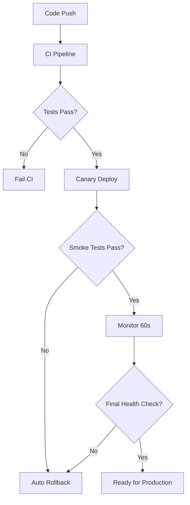

# N1V1 Deployment Guide

This document outlines the CI/CD pipeline and canary deployment strategy for the N1V1 trading framework.

## Table of Contents

1. [CI/CD Pipeline Overview](#cicd-pipeline-overview)
2. [Canary Deployment Strategy](#canary-deployment-strategy)
3. [Prerequisites](#prerequisites)
4. [CI/CD Configuration](#cicd-configuration)
5. [Canary Deployment Setup](#canary-deployment-setup)
6. [Monitoring and Rollback](#monitoring-and-rollback)
7. [Troubleshooting](#troubleshooting)

## CI/CD Pipeline Overview

The N1V1 CI/CD pipeline ensures that every change is thoroughly tested and validated before deployment.

### Pipeline Stages

1. **Build & Test** (Parallel Matrix)
   - Python versions: 3.8, 3.9, 3.10, 3.11
   - Comprehensive test suite execution
   - Code coverage analysis (95% minimum requirement)
   - Linting and type checking

2. **Canary Deployment** (Production branch only)
   - Automated deployment to staging/canary environment
   - Smoke test validation
   - Health check verification
   - Automatic rollback on failure

3. **Production Rollout** (Manual trigger after canary success)
   - Full production deployment
   - Post-deployment monitoring

### Quality Gates

- **Test Coverage**: Minimum 95% code coverage required
- **Test Results**: All tests must pass
- **Linting**: No critical linting errors
- **Type Checking**: All type hints validated
- **Security**: Dependency vulnerability scanning

## Canary Deployment Strategy

Canary deployments allow for safe, incremental rollout of new features with automatic rollback capabilities.

### Deployment Flow



### Environment Strategy

- **Development**: Local testing and development
- **Staging/Canary**: Pre-production validation
- **Production**: Live trading environment

### Rollback Triggers

- Health endpoint failures
- Smoke test failures
- Service unavailability
- Performance degradation
- Manual intervention

## Prerequisites

### Required Secrets

Set these in your GitHub repository secrets:

```bash
DISCORD_WEBHOOK_URL=your_discord_webhook_url
```

### System Requirements

- Python 3.8+
- Docker (for containerized deployment)
- Kubernetes/Helm (for orchestrated deployment)
- Monitoring stack (Prometheus/Grafana)

### Network Requirements

- HTTPS endpoints for health checks
- Webhook access to Discord
- Database connectivity
- External API access (for trading)

## CI/CD Configuration

### GitHub Actions Workflow

The CI/CD pipeline is defined in `.github/workflows/ci.yml`:

```yaml
name: CI

on:
  push:
    branches: [ main, master ]
  pull_request:
    branches: [ main, master ]

jobs:
  build-and-test:
    runs-on: ubuntu-latest
    strategy:
      matrix:
        python-version: [3.8, 3.9, 3.10, 3.11]
    steps:
      - name: Checkout repository
        uses: actions/checkout@v4

      - name: Set up Python ${{ matrix.python-version }}
        uses: actions/setup-python@v4
        with:
          python-version: ${{ matrix.python-version }}

      - name: Install dependencies
        run: pip install -r requirements.txt

      - name: Run comprehensive tests
        run: python tests/run_comprehensive_tests.py --verbose

      - name: Run tests with coverage
        run: |
          python -m pytest --cov=core --cov=api --cov-report=xml --cov-fail-under=95

      - name: Upload coverage reports
        uses: actions/upload-artifact@v4
        with:
          name: coverage-reports-${{ matrix.python-version }}
          path: coverage.xml

  canary-deploy:
    needs: build-and-test
    if: github.ref == 'refs/heads/main'
    runs-on: ubuntu-latest
    steps:
      - name: Run canary deployment
        env:
          CANARY_ENV: staging
          DISCORD_WEBHOOK_URL: ${{ secrets.DISCORD_WEBHOOK_URL }}
        run: ./deploy/canary.sh
```

### Coverage Configuration

Coverage requirements are defined in `.coveragerc`:

```ini
[report]
fail_under = 95
source = core, api, notifier, utils, ml, backtest, data, optimization, portfolio

[run]
source = core, api, notifier, utils, ml, backtest, data, optimization, portfolio
```

## Canary Deployment Setup

### Deployment Script

The canary deployment is orchestrated by `deploy/canary.sh`:

```bash
# Basic usage
./deploy/canary.sh

# Dry run mode
./deploy/canary.sh --dry-run

# Custom environment
./deploy/canary.sh --env=staging

# Disable rollback
./deploy/canary.sh --no-rollback
```

### Environment Configuration

Configure your canary environment URLs in the deployment script:

```bash
# Staging environment
CANARY_URL="http://staging.n1v1.example.com"

# Production environment
PROD_URL="http://api.n1v1.example.com"
```

### Smoke Tests

Smoke tests are defined in `tests/run_smoke_tests.py` and validate:

- Health endpoint (`/health`)
- Readiness endpoint (`/ready`)
- API status endpoint (`/api/v1/status`)
- Basic trading functionality
- System resource usage

Run smoke tests manually:

```bash
# Test local deployment
python tests/run_smoke_tests.py --url=http://localhost:8000

# Test staging deployment
python tests/run_smoke_tests.py --url=http://staging.n1v1.example.com

# JSON output for CI
python tests/run_smoke_tests.py --json
```

## Monitoring and Rollback

### Health Checks

The system implements comprehensive health monitoring:

- **Health Endpoint** (`/health`): Basic service availability
- **Ready Endpoint** (`/ready`): Full service readiness
- **Metrics Endpoint** (`/metrics`): Prometheus metrics

### Rollback Procedures

#### Automatic Rollback

The canary script automatically rolls back on:

1. **Deployment Failure**: If initial deployment fails
2. **Health Check Failure**: If service becomes unhealthy
3. **Smoke Test Failure**: If validation tests fail
4. **Timeout**: If deployment takes too long

#### Manual Rollback

For manual intervention:

```bash
# Stop canary deployment
kubectl scale deployment n1v1-canary --replicas=0

# Rollback to previous version
kubectl rollout undo deployment/n1v1-canary

# Verify rollback
curl http://canary.n1v1.example.com/health
```

### Alerting

#### Discord Notifications

The system sends notifications for:

- Deployment start
- Deployment success
- Deployment failure
- Rollback initiation
- Rollback completion

#### Monitoring Integration

Integrate with your monitoring stack:

```yaml
# Prometheus alerting rules
groups:
  - name: n1v1_canary
    rules:
      - alert: N1V1CanaryUnhealthy
        expr: up{job="n1v1-canary"} == 0
        for: 5m
        labels:
          severity: critical
        annotations:
          summary: "N1V1 canary deployment is unhealthy"
```

## Troubleshooting

### Common Issues

#### CI Pipeline Failures

**Coverage Below Threshold**
```bash
# Check current coverage
python -m pytest --cov=core --cov-report=term-missing

# Run specific tests
python -m pytest tests/core/ -v
```

**Test Timeouts**
```bash
# Increase timeout in CI
timeout: 600  # 10 minutes

# Run tests with verbose output
python tests/run_comprehensive_tests.py --verbose
```

#### Deployment Issues

**Service Not Starting**
```bash
# Check logs
kubectl logs deployment/n1v1-canary

# Check events
kubectl describe deployment n1v1-canary
```

**Health Check Failures**
```bash
# Manual health check
curl -v http://canary.n1v1.example.com/health

# Check application logs
kubectl logs -f deployment/n1v1-canary
```

#### Rollback Failures

**Stuck Rollback**
```bash
# Force rollback
kubectl rollout undo deployment/n1v1-canary --force

# Delete problematic pods
kubectl delete pods -l app=n1v1-canary
```

### Debug Commands

```bash
# Check deployment status
kubectl get deployments
kubectl get pods
kubectl get services

# Check logs
kubectl logs deployment/n1v1-canary --tail=100
kubectl logs -f deployment/n1v1-canary

# Check events
kubectl get events --sort-by=.metadata.creationTimestamp

# Port forward for local testing
kubectl port-forward deployment/n1v1-canary 8000:8000
```

### Performance Issues

**High Resource Usage**
```bash
# Check resource usage
kubectl top pods

# Check resource limits
kubectl describe deployment n1v1-canary
```

**Slow Response Times**
```bash
# Check network latency
curl -w "@curl-format.txt" http://canary.n1v1.example.com/health

# Profile application
python -m cProfile main.py
```

## Best Practices

### Deployment

1. **Always test locally first**
2. **Use feature flags for gradual rollout**
3. **Monitor key metrics during canary**
4. **Have rollback plan ready**
5. **Test rollback procedures regularly**

### Monitoring

1. **Set up comprehensive alerting**
2. **Monitor business metrics, not just technical**
3. **Use canary analysis tools**
4. **Keep detailed deployment logs**
5. **Regular health check validation**

### Security

1. **Use secrets management**
2. **Implement least privilege**
3. **Regular security scanning**
4. **Audit deployment changes**
5. **Secure webhook endpoints**

## Support

For issues or questions:

1. Check the troubleshooting section above
2. Review CI/CD logs in GitHub Actions
3. Check application logs in the deployment environment
4. Contact the DevOps team
5. Create an issue in the project repository

---

*This document is maintained alongside the codebase. Please update it when making changes to the deployment process.*
